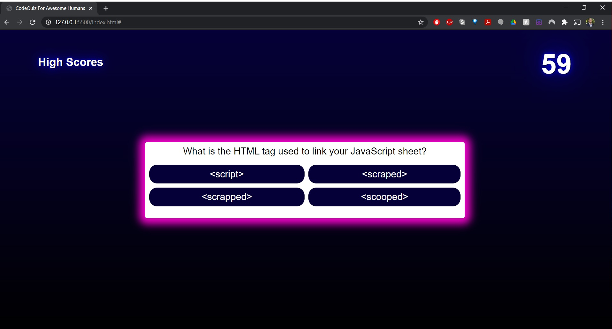

# 04 Web APIs: Code Quiz

My task this week was to build a multiple choice quiz on JavaScript, which contains 5 questions and is timed; the faster you can complete the quiz the better, but wrong answers will deduct time!

I wanted to be able to not only be able to build functional buttons and get a timer to run correctly, but also be able to store answers from the user to a scoreboard. This proved to be a very challenging task!

During this project I learned more about event listeners, displaying class lists/styles, and got a little better and calling vars and consts. I eventually learned a way to get the user input to be able to display on a separate leader board, which was a major accomplishment for me!

The Code Quiz can be found here:
https://brandoncowley.github.io/CodeQuiz/

